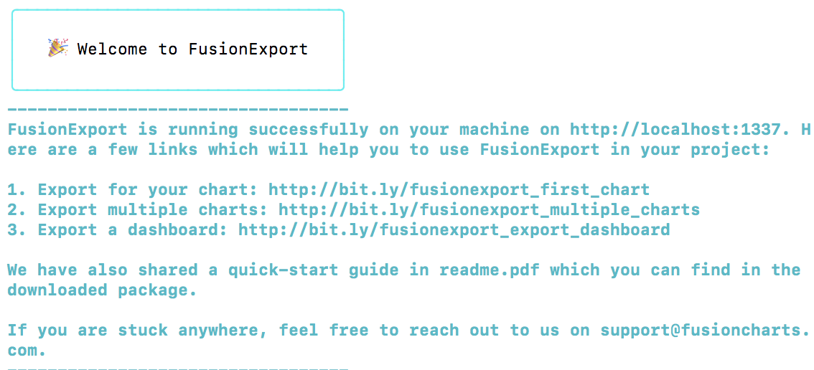
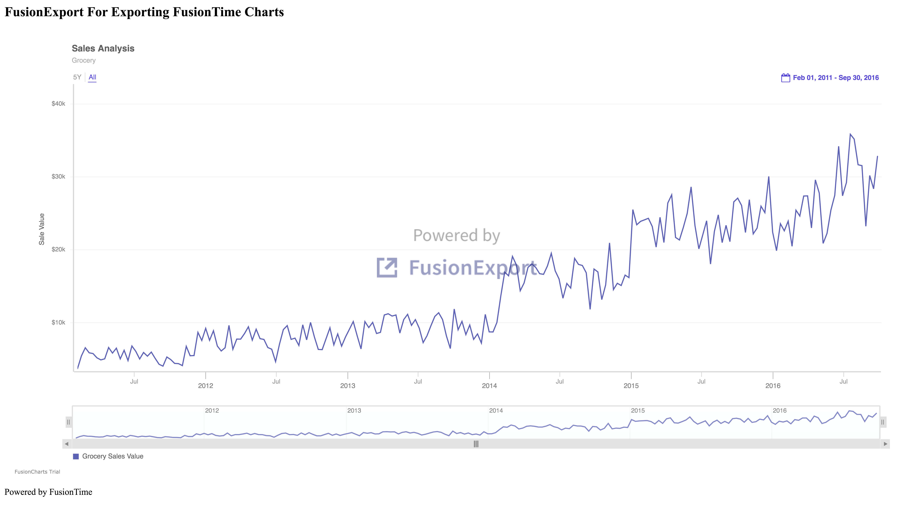

# Exporting FusionTime Charts as PDF From Node.js

## Step 1: Download the FusionExport Server
Download the FusionExport server from the [FusionExport website](https://www.fusioncharts.com/download/fusionexport?framework=javascript)

You need to follow the steps for your OS

## Step 2: Run the server
Find the location of the installed server and run it by typing at the console:

```

YOUR_PATH/fusionexport
```

If the server runs successfully, you will see the following message:



## Step 3: Install the FusionExport sdk for Node.js

At the console type:

```
$ npm install fusionexport-node-client --save
```

## Step 4: Create the Resources
- Create dashboard configuration file in the resources folder (time-series-config.json)
- Create the html template for styling the dashboard (time-series-template.html)

## Step 5: Create the main Node.js file and Run it
Create the export-timeseries.js file, and run the Node.js file using:

```
node export-timeseries.js
```

Export.png will be added to your directory. It loooks as follows:

